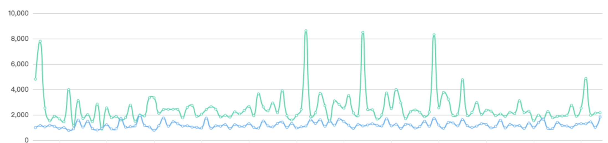

# FastWebView

[  ](https://bintray.com/ryan-shz/Ryan/fastwebview/_latestVersion)

## 背景
Android原生WebView有磁盘缓存最大上限，在4.4之前只有10M，在4.4及其之后虽然提升至20M，但对频繁的H5业务场景来说，还是太小了。HTTP的缓存部分采用LRU缓存算法实现，我们在使用HTTP缓存协议对资源缓存时，太小的缓存空间很容易导致页面缓存被清除，从而重新加载。不仅浪费用户的流量，也会造成不好的用户体验。

如果服务器或者客户端的开发同学对HTTP缓存协议不熟悉，就很容易导致无法高效的利用缓存。况且，就算使用了HTTP协议缓存，在使用本地缓存之前，默认需要经过一次请求来校验缓存是否过期，如果在弱网环境下就会极大的拖慢H5加载速度。

FastWebView通过自定义本地缓存的方式，突破原生WebView缓存限制，提供多种缓存模式，支持预加载和离线加载，并友好的支持离线预推，可以大幅提升H5加载速度。经过千万级用户的项目实践数据证明，二次加载时长缩短100%以上，平均加载时长缩短80%以上。

## 实战数据

千万级日活项目的线上真实数据，屏蔽了项目隐私信息，表中的纵坐标为网页加载整体时长，单位ms。

* 绿线为使用android原生webview加载网页的平均时长

* 蓝线为使用FastWebView加载网页的平均时长



## 特性
1. 自定义本地缓存，提供多种缓存模式，突破原生webview缓存限制
2. 提供资源拦截器支持自定义读取静态资源（比如读取assets/sdcard中的资源替换在线资源）
3. 更方便的cookie管理（自动缓存和发布，且Cookie拦截器让Cookie添加或删除变得更简单）
4. 支持离线加载和预加载
5. 接入成本和侵入性低，很容易集成到现有项目
6. 经过大型项目实战验证，功能稳定，且不断完善中

## Quick Start

### 导入

```
implementation "com.ryan.github:fastwebview:1.1.4"
```

### 使用

将原生的WebView替换为FastWebView，并选择相应的缓存模式即可。

示例代码如下：

```
FastWebView fastWebView = new FastWebView(this);
// 使用强制缓存模式
fastWebView.setCacheMode(FastCacheMode.FORCE);
```

到这里FastWebView已经成功接入，就可以正常使用了。

> Tips：如果现有项目中有自定义的WebView，可将原本继承于原生WebView改为继承FastWebView。
> FastWebView在未开启缓存模式的情况下对现有代码是0侵入的。

## 高级用法

### 1. 缓存模式说明

Fast提供了以下3种缓存模式：

| 缓存模式              | 描述                                                         |
| --------------------- | ------------------------------------------------------------ |
| FastCacheMode.DEFAULT | 默认缓存模式，和原生webview无任何差异，无任何侵入                                                 |
| FastCacheMode.NORMAL  | 普通缓存模式，切换为OkHttp加载资源，磁盘缓存上限提升为100MB        |
| FastCacheMode.FORCE   | 强制缓存模式，切换为OkHttp加载资源，强制缓存不被过滤器过滤的资源 |

#### 1.1. 默认缓存模式

使用默认缓存模式时，FastWebView和原生webview无任何差异, 不会有任何的代码侵入。

```
FastWebView fastWebView = new FastWebView(this);
// 下面这行可以不调用，效果是一样的
fastWebView.setCacheMode(FastCacheMode.DEFAULT);
```

#### 1.2. 普通缓存模式

使用普通缓存模式时，默认的网络请求方式由HttpUrlConnection切换为OkHttp，磁盘缓存上限提升为100MB。

```
FastWebView fastWebView = new FastWebView(this);
fastWebView.setCacheMode(FastCacheMode.NORMAL);
```

#### 1.3. 强制缓存模式

使用强制缓存模式时，默认的网络请求方式由HttpUrlConnection切换为OkHttp，并且FastWebView会无视HTTP缓存协议，强制缓存所加载H5中所有不被过滤器过滤的静态资源。

```
FastWebView fastWebView = new FastWebView(this);
fastWebView.setCacheMode(FastCacheMode.FORCE, cacheConfig);
```

默认的过滤器会过滤**除了JS/CSS/图片/文本文件外**的其他所有静态资源类型，包括**html**。下面列出了可被强制缓存的类型：
```
// JavaScript
addMimeType("application/javascript");
addMimeType("application/ecmascript");
addMimeType("application/x-ecmascript");
addMimeType("application/x-javascript");
addMimeType("text/ecmascript");
addMimeType("text/javascript");
addMimeType("text/javascript1.0");
addMimeType("text/javascript1.1");
addMimeType("text/javascript1.2");
addMimeType("text/javascript1.3");
addMimeType("text/javascript1.4");
addMimeType("text/javascript1.5");
addMimeType("text/jscript");
addMimeType("text/livescript");
addMimeType("text/x-ecmascript");
addMimeType("text/x-javascript");
// image
addMimeType("image/gif");
addMimeType("image/jpeg");
addMimeType("image/png");
addMimeType("image/svg+xml");
addMimeType("image/bmp");
addMimeType("image/webp");
addMimeType("image/tiff");
addMimeType("image/vnd.microsoft.icon");
addMimeType("image/x-icon");
// css
addMimeType("text/css");
// stream
addMimeType("application/octet-stream");
```
> 注意：在此白名单外的资源类型将不会被强制缓存，**但仍支持HTTP缓存协议**。
##### 强制缓存模式的配置选项

```
fastWebView.setCacheConfig(new CacheConfig.Builder()
        .setCacheDir(String fileDir)
        .setExtensionFilter(ExtensionFilter filter)
        .setVersion(int version)
        .setMemorySize(int size)
        .setDiskCacheSize(long diskCacheSize)
        .build());
```

1. setCacheDir(String fileDir) 设置强制缓存目录
2. setExtensionFilter(ExtensionFilter filter) 设置资源类型过滤器
3. setVersion(int version) 设置缓存版本，默认为1
4. setDiskCacheSize(long diskCacheSize) 设置磁盘缓存上限
5. setMemorySize(int size) 设置内存缓存上限

##### 强制缓存模式下如何更新静态资源？

由于FastWebView的强制缓存模式会强制缓存静态资源文件到本地，并且优先使用本地资源。

所以如果需要更新静态资源文件，需要和前端达成约定一致，当静态资源更新时，保证静态资源url地址发生改变。url变化后，FastWebView会重新从网络下载。

#### 资源加载拦截器

> 注意：ResourceInterceptor只对NORMAL和FORCE两种缓存模式生效。

拦截器功能可以让你从任何自定义的文件位置加载静态资源，比如assets目录。

添加拦截器方式如下：

```
FastWebView fastWebView = new FastWebView(this);
fastWebView.addResourceInterceptor(new ResourceInterceptor() {
    @Override
    public WebResourceResponse load(Chain chain) {
    	CacheRequest request = chain.getRequest();
    	// 1.process request	
    	WebResourceResponse response = processRequest(request);
    	if (response != null) {
    		return response;
    	}
    	// 2.pass request to next interceptor
        return chain.process(request);
    }
});
```
#### 3. Cookie选项
FastWebView实现了Cookie数据的自动缓存和上传，并遵循HTTP中Cookie协议，无需任何开关控制。

##### Cookie拦截器

Cookie拦截器用来拦截请求和响应获取到的Cookie列表，从而实现添加自定义Cookie的功能：
```
FastCookieManager cookieManager = fastView.getFastCookieManager();
cookieManager.addRequestCookieInterceptor(CookieInterceptor interceptor);
cookieManager.addResponseCookieInterceptor(CookieInterceptor interceptor);
```
> 注意: FastWebView会使用原生WebView的Cookie数据源，并在内部做好数据同步。
>
> 所以完全不必担心 **CookieInterceptor** 会和 **原生的CookieManager** 之间存在数据不同步的问题。

#### 4. 执行JS脚本

```
fastWebView.runJs(String function, Object... args);
```

#### 5. 预加载

由于首次加载资源时，需要完整加载整个H5页面，加载速度跟原生webview无异。但我们可以使用preload来预加载页面。
```
FastWebView.preload(Context context, String url)
```

## 原理设计图


