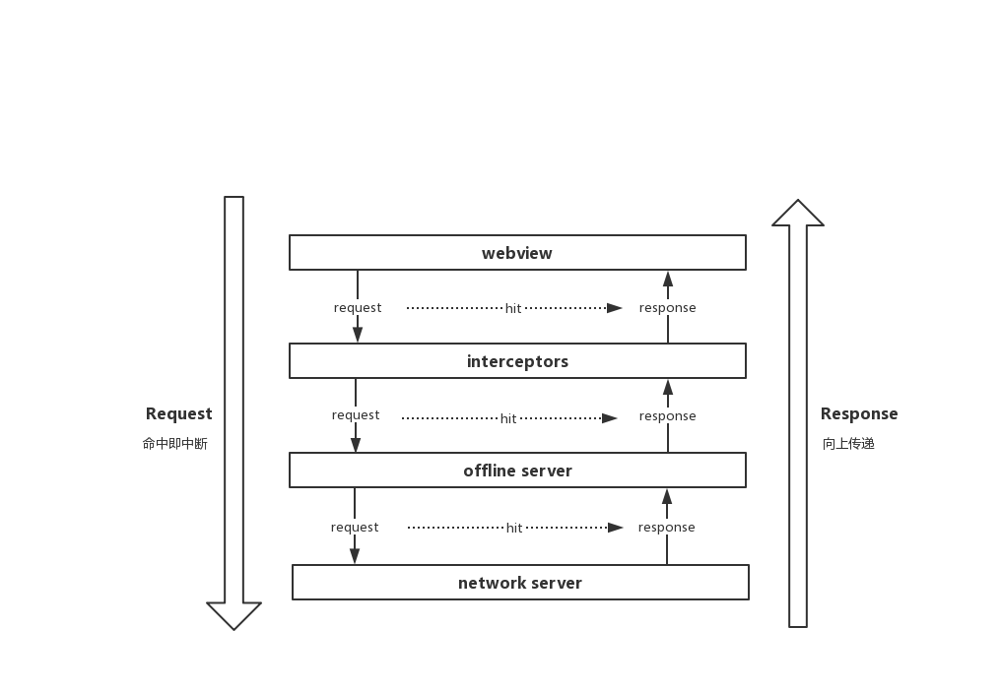

# FastWebView
## 特性

1. 自定义本地缓存，突破原生webview缓存上限限制
2. 提供默认和强制两种缓存模式，并支持http缓存协议
3. 自定义拦截器支持自定义读取静态资源（比如读取assets中的资源）
4. 支持离线加载/预加载
5. 大幅提高WebView二次加载速度
6. cookie自动缓存（提供两种缓存模式：内存缓存或持久缓存）和发布

## 使用方法
将原生的WebView替换为fastwebview即可。fastwebview提供以下两种缓存模式，且均需要手动开启，若未主动开启，则fastwebview和原生webview无任何差异。

### 默认缓存模式

使用默认模式时，默认的网络请求方式由HttpUrlConnection修改为okhttp，并提升webview默认缓存大小上限为100MB。

#### 开启方式

```
FastWebView fastWebView = new FastWebView(this);
fastWebView.openDefaultCache();
```

### 强制缓存模式

#### 开启方式

```
FastWebView fastWebView = new FastWebView(this);
fastWebView.openForceCache();
```

使用强制缓存模式时，fastwebview会无视http缓存协议，强制缓存所加载H5中所有不被过滤器过滤的静态资源。

默认的过滤器会过滤所有音视频和html等资源类型：（即以下类型的资源不会被缓存）

```
public DefaultMimeTypeFilter() {
    addMimeType("text/html");
    // audio
    addMimeType("audio/mpeg");
    addMimeType("audio/midi");
    addMimeType("audio/webm");
    addMimeType("audio/ogg");
    addMimeType("audio/wave");
    addMimeType("audio/wav");
    addMimeType("audio/x-wav");
    addMimeType("audio/mp4");
    addMimeType("audio/x-pn-wav");
    addMimeType("audio/x-ms-wma");
    // video
    addMimeType("video/webm");
    addMimeType("video/ogg");
    addMimeType("video/x-msvideo");
    addMimeType("video/mp4");
    addMimeType("video/mpeg");
    addMimeType("video/quicktime");
    addMimeType("video/x-ms-wmv");
    addMimeType("video/x-flv");
    addMimeType("video/x-matroska");
}
```

#### 强制缓存模式可配置选项

```
fastWebView.setCacheConfig(new CacheConfig.Builder()
        .setCacheDir(String fileDir)
        .setExtensionFilter(ExtensionFilter filter)
        .setVersion(int version)
        .setDiskCacheSize(long diskCacheSize)
        .setMaxMemoryCacheSize(int maxMemoryCacheSize)
        .setMemoryCacheEnable(boolean enable)
        .build());
```

1. setCacheDir(String fileDir) 设置强制缓存目录
2. setExtensionFilter(ExtensionFilter filter) 设置资源类型过滤器
3. setVersion(int version) 设置缓存版本，默认为1
4. setDiskCacheSize(long diskCacheSize) 设置磁盘缓存上限大小
5. setMemoryCacheEnable(boolean enable) 设置是否打开内存缓存，默认为true
6. setMaxMemoryCacheSize(int maxMemoryCacheSize) 设置内存缓存上限大小

### 如何更新静态资源？

由于FastWebView的强制缓存模式会强制缓存静态资源文件到本地，并且优先使用本地资源。

所以如果需要更新静态资源文件，需要和前端达成约定一致，当静态资源更新时，保证静态资源url地址发生改变。url变化后，fastwebview会重新从网络下载。

### 添加资源加载拦截器

需要注意的是，ResourceInterceptor对于以上两种缓存模式都是生效的。

拦截器功能可以让你从任何自定义的文件位置加载静态资源，比如assets目录。

添加拦截器方式如下：

```
FastWebView fastWebView = new FastWebView(this);
fastWebView.addResourceInterceptor(new ResourceInterceptor() {
    @Override
    public WebResourceResponse load(Chain chain) {
    	CacheRequest request = chain.getRequest();
    	// 1.process request	
    	WebResourceResponse response = processRequest(request);
    	if (response != null) {
    		return response;
    	}
    	// 2.pass request to next interceptor
        return chain.process(request);
    }
});
```
### Cookie选项
#### Cookie缓存模式
FastWebView实现了Cookie的自动缓存，并提供了以下两种缓存模式：
```
CookieStrategy.MEMORY; // 内存缓存模式
CookieStrategy.PERSISTENT; // 持久缓存模式
```
可以通过fastWebView.setCookieStrategy(CookieStrategy strategy)接口来设置Cookie缓存模式。

#### Cookie拦截器
Cookie拦截器用来拦截请求和响应获取到的Cookie列表，从而实现添加自定义Cookie的功能。
```
fastWebView.addRequestCookieInterceptor(CookieInterceptor interceptor);
fastWebView.addResponseCookieInterceptor(CookieInterceptor interceptor);
```
### 执行JS脚本

```
fastWebView.runJs(String function, Object... args);
```

### 预加载
由于首次加载资源时，需要完整加载整个H5页面，加载速度跟原生webview无异。但我们可以使用preload来预加载页面。
```
FastWebView.preload(Context context, String url)
```

## 原理设计图


